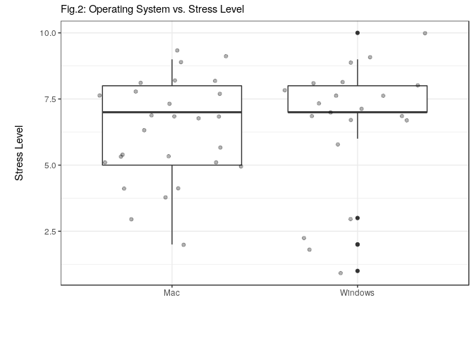

Final Report
================

Our first approach was to try a simple linear regression relating the
response variable - stress levels - with the explanatory variable of
interest, the operating system.

``` r
data <- read_csv("../data/cleaned_data.csv")
```

    ## Parsed with column specification:
    ## cols(
    ##   stress = col_integer(),
    ##   os = col_character(),
    ##   coding = col_character(),
    ##   background = col_character(),
    ##   work_year = col_double(),
    ##   gender = col_character(),
    ##   age = col_integer()
    ## )

``` r
# linear regression with stress and os only
tidy(anova(lm(stress ~ os, data = data)))
```

    ## # A tibble: 2 x 6
    ##   term         df  sumsq meansq statistic p.value
    ##   <chr>     <int>  <dbl>  <dbl>     <dbl>   <dbl>
    ## 1 os            2   4.63   2.32     0.479   0.623
    ## 2 Residuals    49 237.     4.84    NA      NA

A p-value greater than 0.6 suggests that this relationship is not
evidenced by the data. We then proceed to refine our model slightly by
conditioning the model to an ordinal output. This represents an
improvement given that respondents provided their self-assessed stress
levels from a discrete scale of 1 to 10. Here’s what we obtained:

``` r
# proportional odds model, stress and os only
results <- tidy(polr(as.factor(stress) ~ os, data = data))
results <- results %>% 
  mutate(p_value = pnorm(statistic, lower.tail = FALSE))

results
```

    ## # A tibble: 11 x 6
    ##    term      estimate std.error statistic coefficient_type  p_value
    ##    <chr>        <dbl>     <dbl>     <dbl> <chr>               <dbl>
    ##  1 osMac       0.603      0.891     0.677 coefficient      0.249   
    ##  2 osWindows   1.14       0.922     1.24  coefficient      0.108   
    ##  3 1|2        -3.23       1.26     -2.56  zeta             0.995   
    ##  4 2|3        -1.53       0.905    -1.69  zeta             0.955   
    ##  5 3|4        -1.15       0.880    -1.31  zeta             0.905   
    ##  6 4|5        -0.727      0.859    -0.846 zeta             0.801   
    ##  7 5|6        -0.0911     0.834    -0.109 zeta             0.543   
    ##  8 6|7         0.264      0.827     0.319 zeta             0.375   
    ##  9 7|8         1.42       0.851     1.67  zeta             0.0477  
    ## 10 8|9         2.85       0.927     3.07  zeta             0.00107 
    ## 11 9|10        4.75       1.30      3.64  zeta             0.000134

We **approximated** the p\_values of each parameter by calculating the
probability of observing a more extreme statistic in a standard normal
distribution. Again, although Windows seems to suggest higher stress
levels, the results are far from being statistically significant.

Finally, we proceed to one last try, in which we include other
confounders in the model, in the hope of finding some surprising insight
on what may be associated with higher stress levels. Our hypothesis is
that perhaps people with better coding skills (whether it be due to
their background, previous experience or just more confidence in their
abilities), will show less signs of stress.

``` r
# linear regression with coding and background
tidy(anova(lm(stress ~ os + coding + background, data = data)))
```

    ## # A tibble: 4 x 6
    ##   term          df  sumsq meansq statistic p.value
    ##   <chr>      <int>  <dbl>  <dbl>     <dbl>   <dbl>
    ## 1 os             2   4.63   2.32     0.460   0.635
    ## 2 coding         4   7.29   1.82     0.362   0.834
    ## 3 background     5  28.4    5.69     1.13    0.360
    ## 4 Residuals     40 201.     5.04    NA      NA

By running the linear model and analyizing the results in an ANOVA
table, we see that no covariate seems to hold a statistically
significant relationship with our response variable, the stress level.
The p-values are all clearly above any reasonable significance level,
which indicates that no variable, when added to the model, provides any
extra insight on predicting the stress level of students. The graph
below shows this conclusion visually: there is no clear pattern or
relationship between stress level and our hypothesized explanatory
variable, operating system:

<!-- -->

If anything, we could argue that most Windows users are concentrated
around higher stress levels, whereas a significant part of Mac users
present mid-low levels of stress (\< 7 in the 0-10 scale). However, our
linear regression suggests that this could well have happened just due
to random chance, especially given the small amount of data that we
have.
